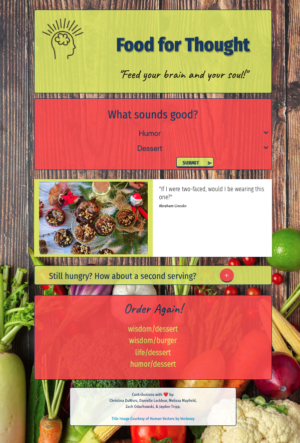

# Food for Thought

## Website Description
Food for Thought is a self help site aiming to support your goals towards positive thinking by combining encouraging quotes and delicious food.

## How it works
Pick a topic that you are struggling with along with a food type you are craving, and Food for Thought will serve you up some wisdom on to feed your mind and soul.

## Tools
This website is built using Visual Studio Code.  
HTML is used to store the website content.  
Javscript was used to fetch data from other sources along with enabling a dropdown list for user selection.  
The user selection options are saved to local storage for retrieval.  

## Website Content
The content displayed on the website was generated by Foodish API ("https://foodish-api.herokuapp.com") and Quotable API ("https://api.quotable.io/"). The final "index.html" is stored on the main branch of the Github repo. 

## Screenshot
 

## Contact
Made by Melissa Mayfield, Zack Odachowski, Jayden Tripp, Christina DuWors, Danielle Locklear

GitHub Repository: https://github.com/Mayfieldmel/food-for-thought.git

Deployed application: https://mayfieldmel.github.io/food-for-thought/
